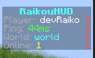
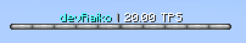
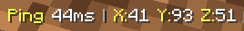
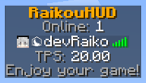

# RaikouHUD

A production-ready HUD plugin for Paper/Spigot **1.21+**.

RaikouHUD provides four modular HUD layers with clean defaults and reload-safe behavior:
- Scoreboard
- BossBar
- ActionBar
- TAB header/footer

---

## Table of Contents
- [Overview](#overview)
- [Core Features](#core-features)
- [Screenshots](#screenshots)
- [Architecture Highlights](#architecture-highlights)
- [Requirements](#requirements)
- [Quick Start](#quick-start)
- [Configuration Guide](#configuration-guide)
- [Commands](#commands)
- [Permissions](#permissions)
- [Built-in Placeholders](#built-in-placeholders)
- [Localization](#localization)
- [Performance Notes](#performance-notes)
- [Development](#development)
- [Troubleshooting](#troubleshooting)
- [Turkce Kisa Rehber](#turkce-kisa-rehber)

---

## Overview
RaikouHUD is designed as a maintainable open-source plugin, not a quick prototype.  
It focuses on:
- modular HUD systems
- clean configuration
- MiniMessage-based formatting
- predictable reload behavior
- safe player/session lifecycle handling

---

## Core Features
- Independent module toggles for Scoreboard, BossBar, ActionBar, and TAB.
- Multi-file configuration for cleaner server-owner editing.
- Bilingual language packs (`en_US`, `tr_TR`) with extensible key-based i18n.
- Placeholder pipeline with built-in placeholders and optional PlaceholderAPI support.
- Central update coordinator to avoid per-player task spam.

---

## Screenshots
### Scoreboard


### BossBar


### ActionBar


### TAB


---

## Architecture Highlights
- `dev.raikou.raikouhud` package base.
- Clear separation by domain: `bootstrap`, `config`, `i18n`, `hud`, `player`, `command`.
- `HudModule` contract for module lifecycle consistency.
- Update buckets by interval (`UpdateCoordinator`) for efficient scheduling.
- Reload flow refreshes config, language bundles, placeholder chain, modules, and schedulers.

---

## Requirements
- Java **21**
- Paper/Spigot **1.21+**

---

## Quick Start
### 1) Build
```powershell
cd "c:\Users\devra\OneDrive\Masaüstü\projects\RaikouHUD"
$env:GRADLE_USER_HOME = "$PWD\.gradle-user-home"
.\gradlew clean build
```

Output jar:
- `build/libs/raikouhud-1.0.0-SNAPSHOT.jar`

### 2) Install
1. Copy jar to your server `plugins/` folder.
2. Start server once.
3. Edit generated files under `plugins/RaikouHUD/`.
4. Run `/raikouhud reload`.

---

## Configuration Guide
### Configuration Files
| File | Purpose |
|---|---|
| `config.yml` | Global plugin settings, locale, module toggles, integration, performance |
| `scoreboard.yml` | Sidebar title/lines, interval, takeover mode, filters |
| `bossbar.yml` | Bar title/style/color/progress settings |
| `actionbar.yml` | ActionBar message and refresh interval |
| `tab.yml` | TAB header/footer and refresh interval |
| `lang/en_US.yml` | English message bundle |
| `lang/tr_TR.yml` | Turkish message bundle |

### Formatting Standard (MiniMessage)
All configurable messages use MiniMessage syntax.

Examples:
```text
<red><bold>RaikouHUD</bold></red>
<gray>Online: <white>%server_online%</white></gray>
<gradient:#ff4d4d:#c63f3f>Red Theme</gradient>
```

### Module Behavior Notes
- `update-interval-ticks`: lower values = more frequent updates and higher cost.
- `permission`: empty string means no permission gate.
- `disabled-worlds`: exact world names where module output is blocked.
- Scoreboard `takeover-mode`:
  - `SOFT`: does not replace another active sidebar.
  - `STRICT`: aggressively takes ownership of sidebar.

---

## Commands
| Command | Description |
|---|---|
| `/raikouhud help` | Show available commands |
| `/raikouhud reload` | Reload config, language, placeholders, and modules |
| `/raikouhud status [player]` | Show global/player module states |
| `/raikouhud toggle <scoreboard\|bossbar\|actionbar\|tab> [player]` | Toggle module for self or target |
| `/raikouhud version` | Show plugin version |

---

## Permissions
| Permission | Default | Description |
|---|---|---|
| `raikouhud.command.use` | `true` | Access base command |
| `raikouhud.command.reload` | `op` | Use reload subcommand |
| `raikouhud.command.status` | `true` | View status |
| `raikouhud.command.status.others` | `op` | View another player's status |
| `raikouhud.command.toggle` | `true` | Toggle own module state |
| `raikouhud.command.toggle.others` | `op` | Toggle module for another player |
| `raikouhud.admin` | `op` | Full admin access |

---

## Built-in Placeholders
| Placeholder | Description |
|---|---|
| `%player_name%` | Player username |
| `%player_display_name%` | Display name |
| `%player_ping%` | Ping in ms |
| `%player_world%` | Current world name |
| `%player_x%`, `%player_y%`, `%player_z%` | Current block coordinates |
| `%player_health%` | Current health value |
| `%player_health_ratio%` | Health ratio (`0.0 - 1.0`) |
| `%server_online%` | Online player count |
| `%server_max_players%` | Max player slots |
| `%server_tps_1m%` | 1-minute TPS (if available) |
| `%time_hhmmss%` | Local server time |

If PlaceholderAPI is installed and enabled (`integrations.placeholderapi: true`), unresolved tokens are passed to PlaceholderAPI.

---

## Localization
Supported language bundles:
- `en_US`
- `tr_TR`

Set in `config.yml`:
```yaml
locale:
  default: en_US
  fallback: en_US
```

---

## Performance Notes
- Prefer sensible intervals (`20` or `40` ticks) unless a module requires high-frequency updates.
- Avoid extremely dense scoreboard/actionbar templates on high-population servers.
- Use per-module/world filters and permission gates to reduce unnecessary rendering.

---

## Development
### Project Structure (high level)
```text
src/main/java/dev/raikou/raikouhud/
  bootstrap/
  command/
  config/
  hud/
  i18n/
  player/
```

### Useful Commands
```powershell
# build
.\gradlew clean build

# resources only
.\gradlew processResources

# full checks (if tests are added later)
.\gradlew check
```

---

## Troubleshooting
### VS Code shows "non-project file"
1. Run `Gradle: Refresh Gradle Project`.
2. Run `Java: Clean Java Language Server Workspace`.
3. Reload the IDE.

### Build fails due dependency download
- Verify internet access to Maven repositories.
- Keep using wrapper (`.\gradlew`) instead of system Gradle.

### Colors not rendering
- Ensure text uses valid MiniMessage syntax.
- Check for malformed tags in config/lang files.

---

## Turkce Kisa Rehber
- Plugin, Paper/Spigot 1.21+ ve Java 21 icin gelistirilmistir.
- Tum mesaj ve HUD metinleri MiniMessage formatindadir.
- Ana dosyalar: `config.yml`, `scoreboard.yml`, `bossbar.yml`, `actionbar.yml`, `tab.yml`, `lang/*`.
- Degisikliklerden sonra: `/raikouhud reload`.
- Derleme:

```powershell
$env:GRADLE_USER_HOME = "$PWD\.gradle-user-home"
.\gradlew clean build
```

---

RaikouHUD is actively structured for maintainability and future module growth.
